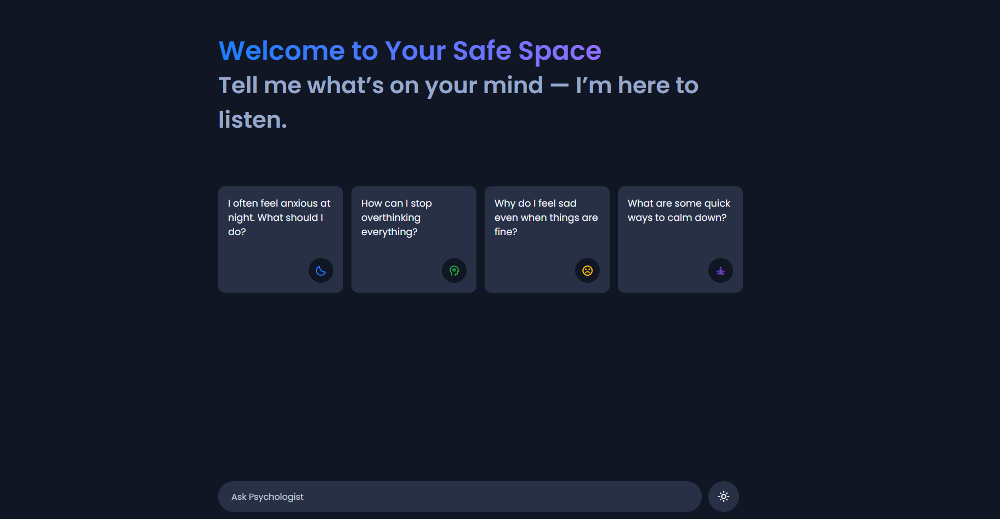
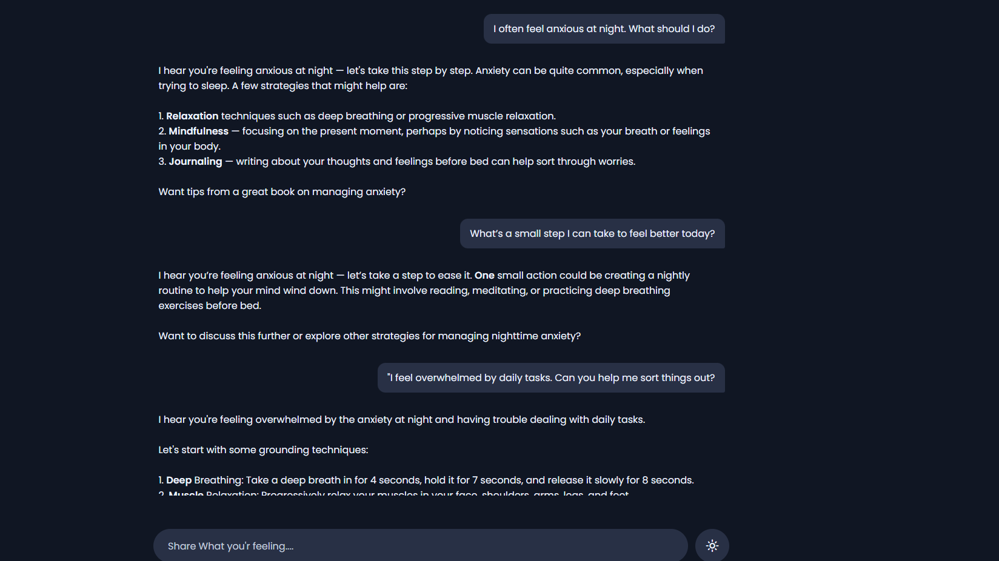

# AI_Psychology_Chatbot
Repository Description AI Psychology Chatbot: An innovative virtual assistant designed to provide empathetic and evidence-based mental health support. Utilizing advanced Natural Language Processing (NLP) techniques and Cognitive Behavioral Therapy (CBT) principles, this chatbot offers personalized responses to users seeking guidance.  
## Features

- Real-time emotion detection (Hugging Face Transformers)
- Crisis keyword monitoring with safety protocols
- Professional therapeutic responses (APA compliant)
- Flask web interface with responsive design

## Quick Start
git clone https://github.com/yourusername/ai-psychology-chatbot.git
cd ai-psychology-chatbot
pip install -r requirements.txt
python app.py

## 🖥️ Interface Preview

*Fig 1. Real-time emotion detection in conversation*

Tech Stack
Python (Flask)
Hugging Face Transformers
OpenRouter API
JavaScript/HTML/CSS

Run
Copy code

Key professional touches:
- Clean emoji-free headings
- Bullet points with technical specifics
- Straightforward setup instructions
- Dedicated image implementation section

